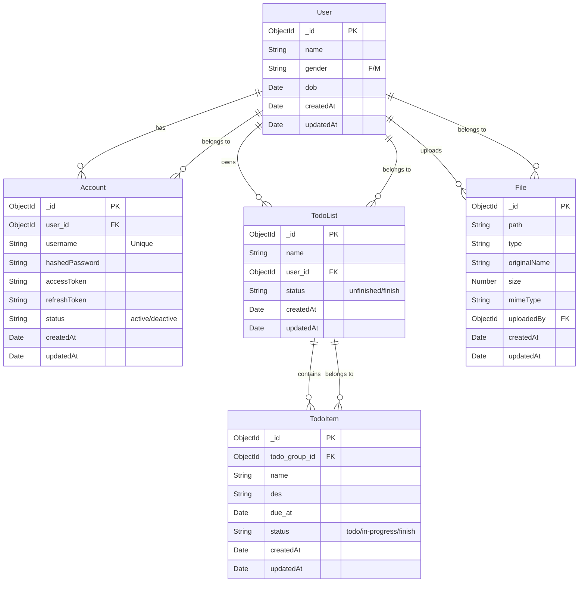
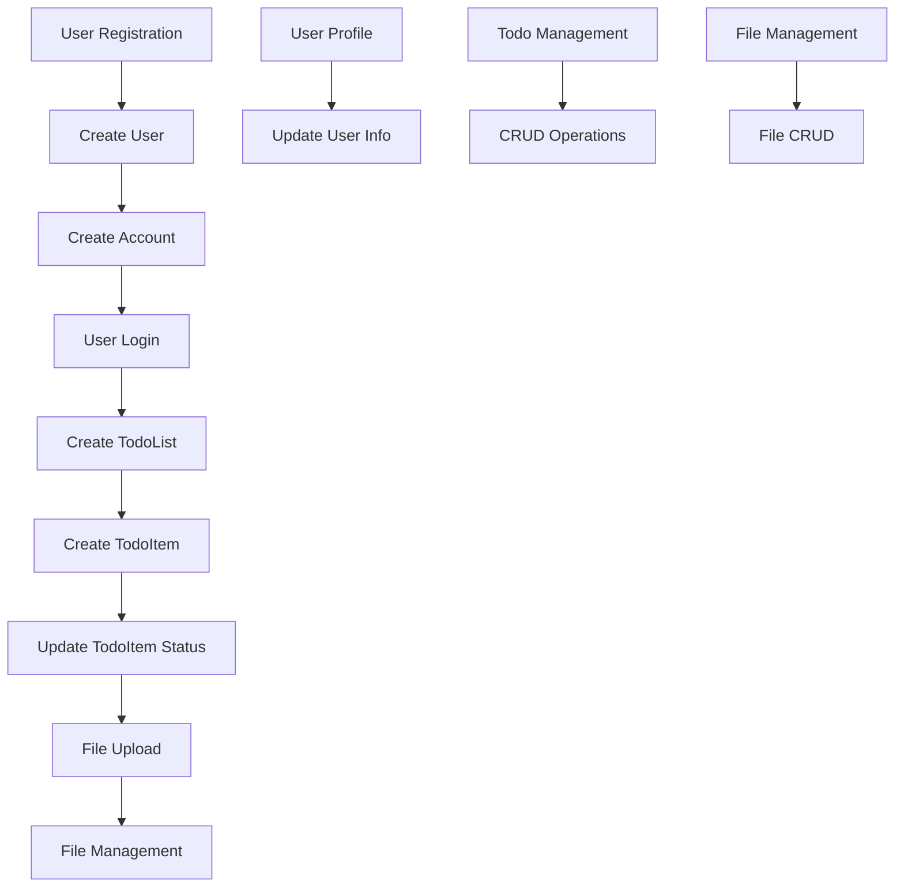

# Database Relationships - MongoDB Models

## 🗄️ Sơ đồ mối quan hệ giữa các Collections



## 📊 Chi tiết mối quan hệ

### 1. **User ↔ Account** (1:1)

- **User** có thể có **1 Account** để đăng nhập
- **Account** thuộc về **1 User**
- **Foreign Key**: `Account.user_id` → `User._id`

### 2. **User ↔ TodoList** (1:N)

- **User** có thể có **nhiều TodoList**
- **TodoList** thuộc về **1 User**
- **Foreign Key**: `TodoList.user_id` → `User._id`

### 3. **User ↔ File** (1:N)

- **User** có thể upload **nhiều File**
- **File** được upload bởi **1 User**
- **Foreign Key**: `File.uploadedBy` → `User._id`

### 4. **TodoList ↔ TodoItem** (1:N)

- **TodoList** có thể chứa **nhiều TodoItem**
- **TodoItem** thuộc về **1 TodoList**
- **Foreign Key**: `TodoItem.todo_group_id` → `TodoList._id`

## 🔍 Virtual Fields và Populated References

### TodoItem Virtual Fields:

- `isOverdue`: Boolean - Todo có quá hạn không
- `timeRemaining`: String - Thời gian còn lại
- `priority`: String - Mức độ ưu tiên (low/medium/high/overdue/completed)

### TodoList Virtual Fields:

- `todoCount`: Number - Số todo items trong list
- `completedCount`: Number - Số todo items đã hoàn thành
- `completionRate`: Number - Tỷ lệ hoàn thành (%)

### File Virtual Fields:

- `url`: String - URL để truy cập file
- `formattedSize`: String - Kích thước file được format
- `isImage`: Boolean - File có phải là image không
- `isDocument`: Boolean - File có phải là document không

### User Virtual Fields:

- `age`: Number - Tuổi được tính từ dob

## 📋 Schema Validation Rules

### User:

- `name`: Required, max 100 chars
- `gender`: Required, enum ['F', 'M']
- `dob`: Required, Date

### Account:

- `user_id`: Required, ref to User
- `username`: Required, unique, min 3 chars, max 50 chars
- `hashedPassword`: Required
- `status`: Required, enum ['active', 'deactive']

### TodoList:

- `name`: Required, max 200 chars
- `user_id`: Required, ref to User
- `status`: Required, enum ['unfinished', 'finish']

### TodoItem:

- `todo_group_id`: Required, ref to TodoList
- `name`: Required, max 200 chars
- `des`: Optional, max 1000 chars
- `due_at`: Required, Date
- `status`: Required, enum ['todo', 'in-progress', 'finish']

### File:

- `path`: Required
- `type`: Required
- `originalName`: Required
- `size`: Required, min 0
- `mimeType`: Required
- `uploadedBy`: Required, ref to User

## 🗂️ Indexes cho Performance

### User Indexes:

- `name`: 1
- `gender`: 1
- `dob`: 1

### Account Indexes:

- `username`: 1 (unique)
- `user_id`: 1
- `status`: 1
- Compound: `{username: 1, status: 1}`

### TodoList Indexes:

- `user_id`: 1
- `status`: 1
- `name`: 1
- Compound: `{user_id: 1, status: 1}`

### TodoItem Indexes:

- `todo_group_id`: 1
- `status`: 1
- `due_at`: 1
- `name`: 1
- Compound: `{todo_group_id: 1, status: 1}`, `{status: 1, due_at: 1}`
- Text: `{name: 'text', des: 'text'}`

### File Indexes:

- `uploadedBy`: 1
- `type`: 1
- `mimeType`: 1
- `createdAt`: -1
- Compound: `{uploadedBy: 1, type: 1}`

## 🔄 Data Flow



## 📈 Query Examples

### 1. Lấy tất cả todo items của một user:

```javascript
const todos = await TodoItem.find()
  .populate({
    path: "todo_group_id",
    match: { user_id: userId },
  })
  .populate("todo_group_id.user_id", "name");
```

### 2. Lấy thống kê todo của một user:

```javascript
const stats = await TodoItem.aggregate([
  {
    $lookup: {
      from: "todolists",
      localField: "todo_group_id",
      foreignField: "_id",
      as: "todoList",
    },
  },
  {
    $match: {
      "todoList.user_id": userId,
    },
  },
  {
    $group: {
      _id: "$status",
      count: { $sum: 1 },
    },
  },
]);
```

### 3. Lấy todo lists với thống kê:

```javascript
const todoLists = await TodoList.find({ user_id: userId })
  .populate("user_id", "name")
  .populate({
    path: "_id",
    model: "TodoItem",
    select: "status",
  });
```

## 🛡️ Security Considerations

1. **Account Security**:

   - Password được hash bằng bcrypt
   - Access token và refresh token được lưu trữ an toàn
   - Account status để enable/disable

2. **Data Access Control**:

   - User chỉ có thể truy cập todo lists của mình
   - File upload được validate và sanitize
   - Input validation cho tất cả fields

3. **Performance**:
   - Indexes được tối ưu cho các query phổ biến
   - Compound indexes cho complex queries
   - Text search với MongoDB text indexes
